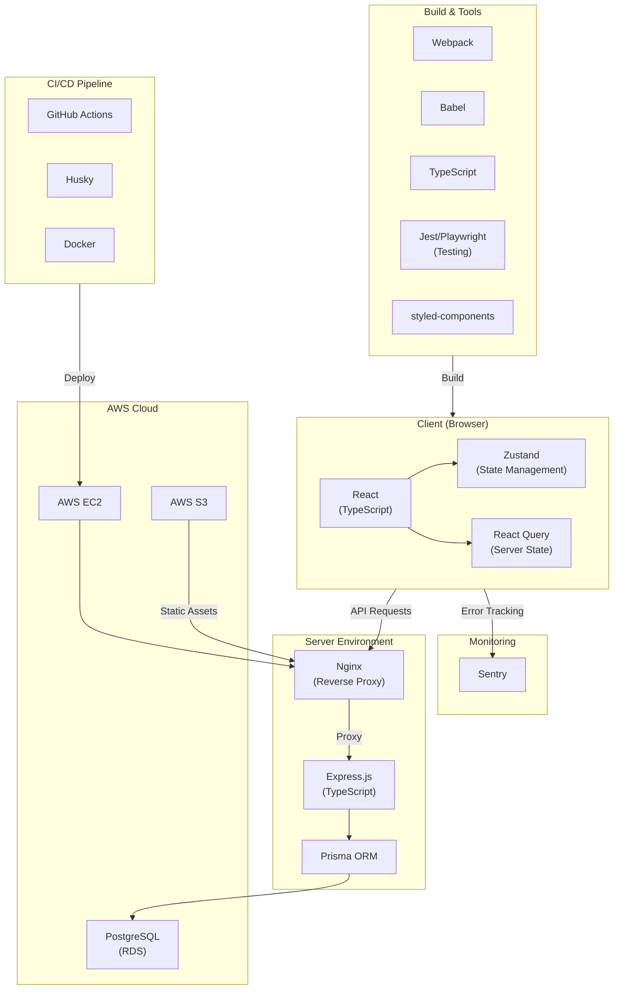

# 🎂 케이꾸 🎂

> 케이크 위에 쌓이는 우정과 사랑, 생일날 열리는 나만의 롤링페이퍼 케이꾸! 👉 https://k-koo.kro.kr/


### Frontend

<div style="display: flex; flex-wrap: wrap; gap: 10px;">
  
  
  
  
  
  
  
  
  
</div>

### Backend

<div style="display: flex; flex-wrap: wrap; gap: 10px;">
  
  
  
</div>

### Etc

<div style="display: flex; flex-wrap: wrap; gap: 10px;">
  
  
  
  
</div>

<br/>

## 📖 Description
특별한 날, 특별한 기억을 케이꾸와 함께 만들어보세요! 🎂

생일에만 열리는 나만의 롤링페이퍼로 사랑과 우정이 담긴 축하 글을 받아보세요.

케이크에 편지를 더하고, 해마다 소중한 추억을 간직할 수 있는 편지함까지!

케이꾸가 전하는 작은 편지, 큰 설렘 – 지금 케이꾸로 잊지 못할 생일을 준비하세요.

## :baby_chick: Demo
<p float="left">
    
    
    
    
    
    
    
</p>

## ⭐ Main Feature

### 회원가입 및 로그인
- JWT, Cookie 이용
- Access Token, Refresh Token 검증 로직 구현

### 케이크 꾸미기
- 회원가입 직후 케이크 시트, 크림 색상 고르도록 로직 구현
- 언제든지 원하는 색상으로 수정 가능

### 편지 조회, 작성
- 케이크 조회시 올해 받은 편지 조회 구현
- 연도별로 보관된 편지 조회 구현, 윈도윙 적용
- 친구 케이크 조회시 장식초 고르기, 편지 작성 구현

### 편지 수신 알림
- Web Worker를 활용한 푸시 알림 기능 구현

### 기타 기능
- 링크 공유 (카카오, 페이스북, URL 복사)
- 마이페이지 (회원 정보 조회/수정, 탈퇴, 로그아웃)
- 아이디, 비밀번호 찾기 (이메일 인증)


## 💻 Getting Started
### Installation
```
pnpm install
```
### Develop Mode
```
pnpm run dev
```
### Production
```
pnpm run build

pnpm run start
```

## :open_file_folder: Project Structure

```markdown
/////////////////////////////////////
// turborepo를 활용한 모노레포 구조 //
/////////////////////////////////////

KKOO
├── .github
├── .husky
├── apps
│   ├── client              // 클라이언트
│   │   ├── config
│   │   ├── e2e
│   │   ├── public
│   │   ├── src
│   │   │   ├── apis
│   │   │   ├── assets
│   │   │   ├── components
│   │   │   ├── hooks
│   │   │   ├── pages
│   │   │   ├── store
│   │   │   ├── styles
│   │   │   ├── test
│   │   │   ├── utils
│   │   |   ├── App.css
│   │   |   ├── App.tsx
│   │   |   ├── index.tsx
│   │   |   ├── ModalPortal.ts
│   │   |   └── firebase-messaging-sw.ts
│   │   ├── Dockerfile
│   │   ├── package.json
│   │   ├── playwright.config.ts
│   │   ├── tsconfig.json
│   │   ├── webpack.config.dev.js
│   │   └── webpack.config.prod.js
│   ├── server             // 서버
│       ├── src
│       │   ├── models     // Prisma CRUD 모듈 함수 모음
│       │   ├── routes     // API 요청 수신, 응답 반환
│       │   └── service    // 비즈니스 로직
│       ├── Dockerfile
│       ├── package.json
│       ├── tsconfig.json
│       └── .eslintrc.js
├── packages               // 클라이언트, 서버 공통 모듈 or 구성 파일
│   ├── database           // Prisma 클라이언트
│   ├── eslint-config
│   ├── jest-presets
│   ├── schemas            // Zod 타입 정리
│   ├── types
│   ├── typescript-config
|   └── utils
├── .dockerignore
├── .gitignore
├── docker-compose-cache.json
├── docker-compose.yml
├── nginx.conf
├── package.json
├── pnpm-lock.yaml
├── pnpm-workspace.yaml
├── README.md
└── turbo.json

```

## 🔨 Architecture


## ⚒ CI/CD
- github actions를 활용해서 지속적 통합 및 배포
- origin에 push할 경우, `husky`를 활용해 테스트 코드, 포맷팅, 린팅 검사를 하고 통과될 경우 push에 성공한다.
- `feature` 브랜치에서 `develop`으로 Pull Request를 보내면, CI가 동작된다.
- `develop`에서 `main`로 Pull Request를 보내면, CI가 동작되고 Merge가 되면, 운영 리소스에 배포된다.

## 👨‍💻 Role & Contribution

**Frontend (Web)**
- 회원가입, 로그인
- 마이페이지
- 케이크 조회/생성/수정
- 편지 조회/생성 (올해, 연도별)
- 링크 공유

**Server**
- AWS EC2, S3 클라우드 환경 세팅
- Express.js 세팅
- Nginx 세팅

**Devops**
- CI/CD 구축 (Docker, Github Action)
- 서버 모니터링

**etc**
- 기획, 디자인
- 전체 기술 스택 선정
- 전체 아키텍처 구성
- 전체 개발 일정 및 이슈 관리

## 👨‍👩‍👧‍👦 Developer
<div align="center">

| **이은영** | **김예린** |
| :------: |  :------: | 
| [ <br/> @ieun32](https://github.com/ieun32) | [ <br/> @kyr4601](https://github.com/kyr4601) | 
</div>

